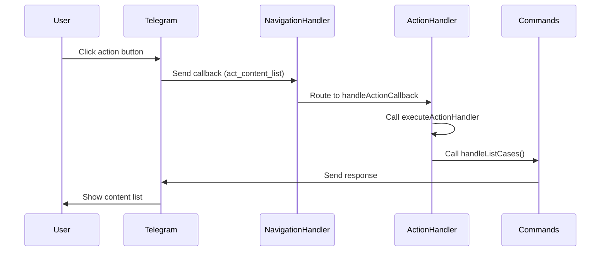

# Navigation Action Handler Fix Design

## Overview

This document outlines the design and implementation plan to fix issues with the navigation action handlers in the Telegram CMS project. The main problem is that while the navigation UI works visually, actual command functions are not being executed when users click action buttons.

The root cause is that action buttons in category menus are generating navigation callbacks (`nav_`) instead of action callbacks (`act_`). The infrastructure for handling `act_` callbacks already exists and works correctly, but it never gets triggered because the buttons generate the wrong callback type.

## Architecture

The Telegram CMS uses a modular architecture with the following key components related to navigation:

1. **NavigationHandler** (`handlers/navigation.js`) - Processes callback queries and routes them to appropriate handlers
2. **NavigationManager** (`utils/navigationManager.js`) - Generates navigation menus and buttons
3. **ActionHandlers** (`handlers/actionHandlers.js`) - Maps callback data to actual command functions
4. **Command Modules** (`commands/*.js`) - Contains the actual implementation of bot commands

The correct flow should be:
```
User clicks action button → Telegram sends act_ callback → NavigationHandler processes act_ callback → ActionHandlers maps to command → Command executes
```

However, the current incorrect flow is:
```
User clicks action button → Telegram sends nav_ callback → NavigationHandler processes nav_ callback → Custom handler tries to map to command → Command execution fails
```

## Issues Identified

### Issue 1: Incorrect Callback Type for Action Buttons

**Problem**: Action buttons in category menus are generating navigation callbacks (`nav_`) instead of action callbacks (`act_`).

In `utils/navigationManager.js` line ~269, in the `_generateCategoryKeyboard` method:
```javascript
keyboard.text(
  action.title, 
  NavigationHelpers.generateCallback('nav', categoryId, action.id)  // This generates nav_content_list
);
```

This should generate `act_content_list` instead to be properly handled by the existing `handleActionCallback` method.

### Issue 2: Unnecessary Custom Handler

**Problem**: The `handleCategoryActionNavigation` function in `handlers/navigation.js` is unnecessary because the infrastructure for handling `act_` callbacks already exists and works correctly.

There's already a handler for `act_` callbacks in `handlers/navigation.js` line ~40:
```javascript
bot.callbackQuery(/^act_/, this.handleActionCallback.bind(this));
```

This handler correctly calls `executeActionHandler`, which maps to the command functions. But it never gets triggered because the buttons generate `nav_` callbacks instead.

### Issue 3: Missing Dependency

**Problem**: The `node-fetch` package is imported in `services/api.js` but may not be properly installed.

While the package.json shows that node-fetch is listed as a dependency, if there are runtime errors, we might need to reinstall it:
```bash
npm install node-fetch@2
```

## Solution Design

### Why the Previous Approach Was Incorrect

The previous approach of modifying the `handleCategoryActionNavigation` function to convert `nav_` callbacks to `act_` format was a band-aid solution that addressed the symptom rather than the root cause.

The issues with that approach were:
1. It added unnecessary complexity by creating a custom handler when the infrastructure already existed
2. It didn't leverage the existing, working `handleActionCallback` method
3. It tried to fix the problem at the wrong point in the flow

The correct approach is to fix the root cause: ensure that action buttons generate the correct callback type from the start.

### Solution 1: Fix Button Generation

Update button generation in `utils/navigationManager.js` line ~269 to use `'act'` instead of `'nav'`:

In the `_generateCategoryKeyboard` method:
```javascript
// WRONG:
keyboard.text(
  action.title, 
  NavigationHelpers.generateCallback('nav', categoryId, action.id)  // This generates nav_content_list
);

// CORRECT:
keyboard.text(
  action.title, 
  NavigationHelpers.generateCallback('act', categoryId, action.id)  // This generates act_content_list
);
```

### Solution 2: Remove Unnecessary Handler

The `handleCategoryActionNavigation` function is unnecessary. Once buttons generate `act_` callbacks, they'll be handled by the existing `handleActionCallback` method which already works correctly.

The previous approach of trying to convert `nav_` callbacks to `act_` format was a band-aid solution. The correct approach is to generate the right callbacks from the start, leveraging the existing infrastructure that already works correctly.

### Solution 3: Ensure node-fetch is installed

Verify that `node-fetch` is properly installed:
```bash
npm install node-fetch@2
```

### Solution 4: Verify Existing Infrastructure

Confirm that the existing infrastructure for handling `act_` callbacks is properly set up:

In `handlers/navigation.js` line ~40, ensure this exists:
```javascript
bot.callbackQuery(/^act_/, this.handleActionCallback.bind(this));
```

This handler correctly calls `executeActionHandler`, which maps to the command functions.

### Solution 4: Verify node-fetch Installation

The package.json shows that node-fetch is already listed as a dependency:
```json
"dependencies": {
  "dotenv": "^16.4.5",
  "grammy": "^1.30.0",
  "node-fetch": "^2.7.0"
}
```

However, if there are runtime errors, we might need to reinstall it:
```bash
npm install node-fetch@2
```

## Implementation Plan

### Step 1: Fix Button Generation

In `utils/navigationManager.js`, find the `_generateCategoryKeyboard` method (around line 269) and update the callback generation:

```javascript
// Change from:
keyboard.text(
  action.title, 
  NavigationHelpers.generateCallback('nav', categoryId, action.id)
);

// Change to:
keyboard.text(
  action.title, 
  NavigationHelpers.generateCallback('act', categoryId, action.id)
);
```

This ensures that action buttons generate `act_content_list` instead of `nav_content_list`.

### Step 2: Verify handleActionCallback Works

Ensure that the existing `handleActionCallback` method in `handlers/navigation.js` is properly set up to handle `act_` callbacks:

```javascript
bot.callbackQuery(/^act_/, this.handleActionCallback.bind(this));
```

This method already correctly calls `executeActionHandler`, which maps to the command functions.

### Step 3: Simplify or Remove handleCategoryActionNavigation

The `handleCategoryActionNavigation` function in `handlers/navigation.js` can be simplified or removed since it's no longer needed. With the correct callback generation, action buttons will be handled by the existing `handleActionCallback` method.

### Step 4: Verify Dependencies

Ensure node-fetch is properly installed:
```bash
npm install node-fetch@2
```

### Step 5: Test Integration

After implementing the fixes, test the following flows:
1. Navigate to Content Management → List All Content
2. Navigate to Analytics → View Analytics
3. Navigate to System Tools → System Status

Each should execute the corresponding command function and display actual content rather than just refreshing the same menu.

## Business Logic

The core business logic change is in how navigation buttons generate callback data:

1. Action buttons in category menus should generate `act_` callbacks instead of `nav_` callbacks
2. These callbacks will be handled by the existing `handleActionCallback` method
3. The `handleActionCallback` method calls `executeActionHandler` for proper command execution
4. The command functions execute and return actual content to the user

## API Endpoints

No changes to API endpoints are required for this fix.

## Testing

### Unit Tests

1. Test `handleCategoryActionNavigation` with various callback formats
2. Verify action handler mapping works correctly
3. Test error handling for missing or invalid actions

### Integration Tests

1. Test full navigation flow from main menu to action execution
2. Verify "message not modified" errors are resolved
3. Test workflow interruption handling
4. Test specific action flows:
   - Content Management → List All Content (should show actual content list)
   - Analytics → View Analytics (should show analytics data)
   - System Tools → System Status (should show system information)
   - Content Management → Create Content (should start creation workflow)
   - Help → Usage Guide (should show help text)

### Specific Validation Checks

1. After fixing, console logs should show `[NAVIGATION] User X executing action: act_content_list` (not `nav_content_list`)
2. The `executeActionHandler` function should be called (add a log to verify)
3. Actual content should appear, not the same menu

## Diagrams

### Navigation Flow



## Security Considerations

No security changes are required for this fix. The existing authentication and authorization mechanisms remain unchanged.

## Performance Considerations

No performance changes are expected from this fix. The navigation flow should be as performant as direct command execution.

## Error Handling

The existing error handling in the `handleActionCallback` method will be used, which includes:
1. If action execution fails, log warning but don't crash
2. Proper error messages are sent to the user
3. Maintain existing error handling patterns from the codebase

## Rollback Plan

If issues arise after deployment:
1. Revert changes to `utils/navigationManager.js`
2. Restore the original callback generation in `_generateCategoryKeyboard` method
3. Restart the bot service
4. Monitor logs for any remaining issues

## Monitoring and Validation

After deployment, monitor the following:
1. Check bot logs for any errors related to navigation or action handling
2. Verify that all navigation paths execute their intended commands
3. Confirm that no "message not modified" errors occur
4. Ensure that workflow interruption handling works correctly
5. Validate that all command functions are accessible through both navigation buttons and direct commands

## Conclusion

The key insight is that the Telegram CMS project already had a working infrastructure for handling action callbacks (`act_`), but action buttons were incorrectly generating navigation callbacks (`nav_`) instead. By fixing the button generation to use the correct callback type, we can leverage the existing, well-tested infrastructure rather than creating custom solutions. This approach is simpler, more maintainable, and less error-prone.